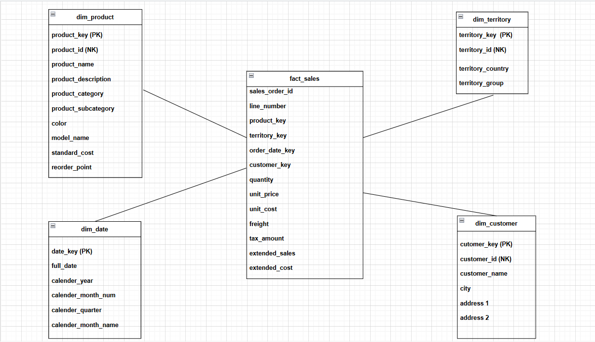

# SALES_DATA_MART

This project builds a Sales Data Mart using the **AdventureWorks** database from Microsoft as the source data. The data mart is designed to support analytical queries for sales data by organizing data into dimension and fact tables. SSIS (SQL Server Integration Services) is used as an ETL (Extract, Transform, Load) tool to extract data from AdventureWorks, transform it into a dimensional model, and load it into the sales data mart. 

## The Data Model

## Folder Structure
- **Creating Dimension and Fact Tables**: 
  - Contains SQL scripts and documentation related to the creation of dimension and fact tables.
  - Dimension tables store descriptive information (e.g., products, customers, regions) that are used for filtering and grouping sales data.
  - Fact tables store quantitative data (e.g., sales transactions) and are linked to dimension tables through foreign keys.

- **Source Data**:
  - Includes the raw data from the **AdventureWorks** database used to populate the dimension and fact tables. These are the datasets that the ETL process transforms and loads into the final schema.
  - It also includes a file called **date.xls**, which is an Excel file used to populate the date dimension.

- **SQL Scripts - ETL**:
  - Contains SQL scripts responsible for extracting data from source systems, transforming it to fit the dimensional model, and loading it into the data mart.

- **SSIS Project**:
  - This folder includes the SSIS (SQL Server Integration Services) project files.
  - SSIS is used to automate the ETL process by defining data flow tasks and scheduling them to run at specified intervals.
  - The project files here can be opened and edited in Visual Studio or SQL Server Data Tools (SSDT).